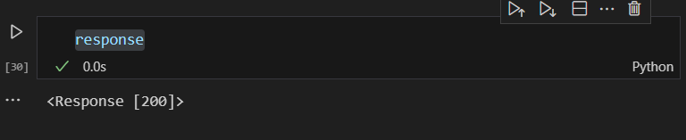

# Exno-2appds
**AIM:**
    
    To Perform Data Collection through web scraping using python.

**ALGORITHM:**
	#Step 1: Include the Necessary python libraries.
 
	Step 2: Use the requests library to send HTTP requests to a web page.
 
	Step 3: Retrieve the HTML content and use BeautifulSoup to parse it.
 
	Step 4: Navigate and extract the necessary data.
 
	Step 5: Handle the Java script content and retrieve the data using the html tags.
 
	Step 6: Check with the website permission and scrap the content.

**CODING & OUTPUT:**
```py
import requests
url = 'https://www.w3schools.com/html/html_tables.asp'
response = requests.get(url)
html_content = response.text
```
```py
html_content
```
```py
from bs4 import BeautifulSoup
soup = BeautifulSoup(html_content, 'html.parser')
```
```py


from selenium import webdriver
from selenium.webdriver.chrome.options import Options


options = Options()
options.add_argument('--headless')
options.add_argument('--no-sandbox')
options.add_argument('--disable-dev-shm-usage')
```

```py
url = 'https://www.geeksforgeeks.org/python-programming-language-tutorial/'
response = requests.get(url)
soup = BeautifulSoup(response.text, 'html.parser')
import pandas as pd
```
```py
headings = soup.find_all('h3')
for heading in headings:
    print(heading.text)
```


```py
data = []
for heading in headings:
    data.append(heading.text)
df=pd.DataFrame(data,columns=['Heading'])
df.to_csv('new_data',index=False)
```


```py
df.head()
```


## WEB SCRAPPING USING YOUTUBE WEBSITE

```py
import requests
from bs4 import BeautifulSoup
import pandas as pd
url="https://www.youtube.com/"
page =1
```

```py
def rev_scrap(url,page):
    url = f"{url}&pageNumber={page}"
rev_scrap(url,page)
user_agent = {"User-Agent": "Mozilla/5.0"}
response = requests.get(url=url,headers=user_agent)
```
```py
response
```

**RESULT:**
 web scrapping executed sucessfully
